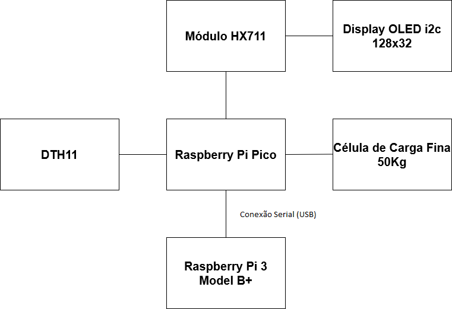

# Project_Smart_Holder_Dashboard

Repositório para continuação do projeto [Project_Smart_Holder](https://github.com/Dragonrhs/Project_Smart_Holder) referente ao Trabalho T2 e T3 da materia de Microcontroladores e Sistemas Embarcados EEN251, sobre supervisão dos professores Sergio Ribeiro Augusto e Rodrigo França.

# Sumário

- [Descrição](#Descrição)
- [Requisitos](#Requisitos)
- [Materiais utilizados](#Materiais-utilizados)
- [Custos Estimado](#Custos-Estimado)
- [Funcionamento](#Funcionamento)
- [Diagrama de blocos do sistema](#Diagrama-de-blocos-do-sistema)
- [Esquema Elétrico](#Esquema-Elétrico)
- [Red Nodes](#Red-Nodes)
- [Dashboard](#Dashboard)
- [Autores](#Autores)

# Descrição 

O projeto consiste em aprimorar o smart holder, fazendo com que os dados medidos pelos sensores sejam captados e em sequência exibidos em um dashboard, para isso foram feitas alterações para viabilizar o aprimoramento.

# Requisitos 

O projeto deve apartir do peso da garrafa colocada saber se ela esta vazia ou cheia indicando atraves de leds essa informaçao, deve apresentar no display a temperatura que a bebida está, deve ter uma fonte de alimentação seja por meio da fonte ou opcionalmente por meio da bateria e todos esses dados devem ser enviados para o dashboard para uma visualizaçao melhorada.

| ID    |                        Requisito                    |    Tipo       |
| :-----|-----------------------------------------------------|--------------:|
| UR-01 | Medir a temperatura interna da garrafa              |Obrigatório    |
| UR-02 | Medir o peso da garrafa                             |Obrigatório    |
| UR-03 | Mostrar a temperatura no display                    |Obrigatório    |
| UR-04 | Leds devem ascender de acordo com o peso da garrafa |Obrigatório    |
| UR-05 | Tem que ter uma fonte de energia para alimentação   |Obrigatório    |
| UR-06 | Deve apresentar os dados medidos em um dashboard    |Obrigatório    |
| UR-07 | Uso de bateria para alimentação                     |**Desejável**  |

# Materiais utilizados

- Porta garrafa
- 1 Sensor Temperatura e Umidade DTH11 
- 1 Display OLED i2c OLED 128x32 Px 
- 1 Raspberry Pi Pico
- 1 Módulo HX711
- 1 Célula de Carga Fina 50 Kg
- 3 Leds(vermelho, amarelo, verde)
- 1 Raspberry Pi 3 model b+
- 3 resitores 220 Ω
- Jumpers

# Custo Estimado 

| Item                      |   Preço    | 
| :-------------------------|-----------:|
| DTH11                     | R$8,90     |
| OLED i2c                  | R$10,97    |
| Raspberry Pi Pico         | R$33,90    |
| HX711                     | R$5,90     |
| Célula de carga           | R$7,90     |
| Leds x 3                  | R$0,72     |
| Porta garrafa             | R$18,49    |
| 1 Raspberry Pi 3 model b+ | R$385,60   |
| resistor 220 Ω x3         | R$0,30     |
| **Total**                 |**R$472,38**|

# Funcionamento

## Teste do sistema com as novas funcionalidade

## Diagrama de blocos do sistema

## Esquema Elétrico

## Red Nodes

## Dashboard

# Autores
- [Ryuske Hideaki Sato 21.00745-4](https://github.com/Dragonrhs)
- [Gabriel Henrique Baca Rado 21.01286-5](https://github.com/Gabriel-HBR)
- [Vinícius de Oliveira Berti 21.01219-9](https://github.com/ViniciusBerti)
- [Erick Eiji Nagao 21.00690-3](https://github.com/ErickNagao)

